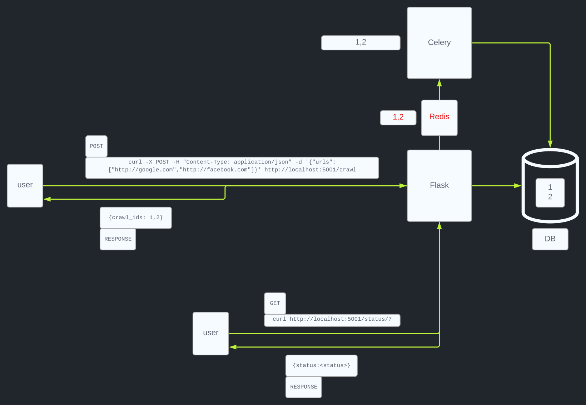

# web-crawler

**This project is a web crawling application built with Flask, Celery(Redis) and SQLite.**

## Prerequisites

**Before running the project, ensure you have the following installed:**

- Docker: [Install Docker](https://www.docker.com/get-started)

## Getting Started

**Follow the steps below to set up and run the project locally.**
****

Start the Docker containers:

```
docker-compose up --build
```


This command will start the Flask application, Celery worker, and Redis service.
****
Make a POST request to initiate crawling:

```
curl -X POST -H "Content-Type: application/json" -d '{"urls": ["http://google.com","http://facebook.com","http://twitter.com","http://apple.com","http://sony.com","http://soundcloud.com","http://kenwood.com"]}' http://localhost:5001/crawl
```

The `<urls>` parameter should be an array of URLs you want to crawl. Adjust the URLs as needed.
****
Check the status:

```
curl http://localhost:5001/status/7
```

The `status/<int>` parameter should be a crawl id
****

